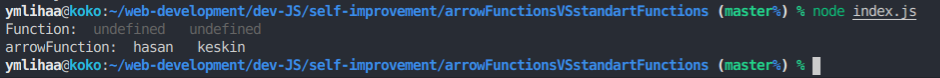

# Arrow functions VS Regular Functions

<p>
    Arrow fonksiyonlar ile standart fonksiyonlar temelde aynı şeyi yaparlar 
    fakat arrow fonksiyonunun bazı kolaylıkları vardır .
</p>

<ul>
    <li>
        Daha az kod yazma (ama asıl önemi bu değil)
    </li>
    <li>
        This keyword' ü ile davranış farklılıkları 
    </li>
</ul>

### For Example :

##### Regular Function

```
    function printName(name){
    console.log(name);
    }
```

##### Arrow Function

```
    const printName = name => console.log(name);
```

<p>
Görüldüğü üzere arrow function ile baya hoş kod yazabiliyoruz .
<br>
Arrow function u bir değişkene atamamız farklı bir şey yapıyormuşuz gözüksede aslında ,
function keyword ü ile standart function'larda ,fonksiyonu bir değişkene atamaktadır.
<br>
Fakat Arrow functionları arrow function yapan olay bu değildir.
Asıl mesele this keywordünü kendi scope'u içerisinde yeniden tanımlamamasıdır.
Yani ne demek istiyorum .
</p>

```
class Person {
  constructor(name, surname) {
    this.name = name;
    this.surname = surname;
  }
  printNameArrow() {
    setTimeout(() => {
      console.log("arrowFunction: ", this.name, " ", this.surname);
    }, 100);
  }
  printNameFunction() {
    setTimeout(function () {
      console.log("Function: ", this.name, " ", this.surname);
    });
  }
}
const PersonHasan = new Person("hasan", "keskin");
PersonHasan.printNameArrow();
PersonHasan.printNameFunction();
```

<p>
Yukarıdaki kodu incelediğimiz de iki fonksiyonda aynı işlemi yapacağını görürüz.
Aralarında ki tek fark this ' e erişim farkı olacaktır .
Gelin çıktılarını görelim .</p>
<br>



<br>
<p>Görüldüğü üzere standart fonksiyonumuz this.name için undefined dönerken , arrow fonksiyonumuz ismimizi basmış.</p>

###### Bunun sebebi;

<br>
<p>

Normal işlevlerde this 'in değeri , fonksiyonu çağıran nesneyi temsil etmesidir .
Bu window ,document, button veya herhangi birşey olabilir.
Yani demeye çalıştığım :

</p>

```
// Regular Function:
hello = function() {
  document.getElementById("demo").innerHTML += this;
}

// The window object calls the function:
window.addEventListener("load", hello); ----> Burada this değeri window nesnesi olacaktır .

// A button object calls the function:
document.getElementById("btn").addEventListener("click", hello); ---> burada this değeri button olacaktır .

```

<p>
    Arrow fonksiyonlarda this 'in değeri herzaman arrow fonksiyonu tanımlayan nesneyi temsil eder . Yani arrow functionunda this bu fonksiyonun sahibini temsil eder. <br>
    Bu eğer global tanımlanmış ise window'u , bir sınıf içerisinde tanımlanmış ise o sınıfı veyahut herhangi birşeyi .
</p>

##### Bunu da örnekle açıklayacak olursam ;

```

// Arrow Function:
hello = () => {
document.getElementById("demo").innerHTML += this;
}

// The window object calls the function:
window.addEventListener("load", hello); ----> burada da this window ' a eşittir.

// A button object calls the function:
document.getElementById("btn").addEventListener("click", hello); -----> burada da this window' a eşittir .

```

#### Kaynakça :

<a>
[I'm a reference-style link][https://www.w3schools.com/js/js_arrow_function.asp]
[I'm a reference-style link][https://www.youtube.com/watch?v=h33Srr5J9nY&t]
